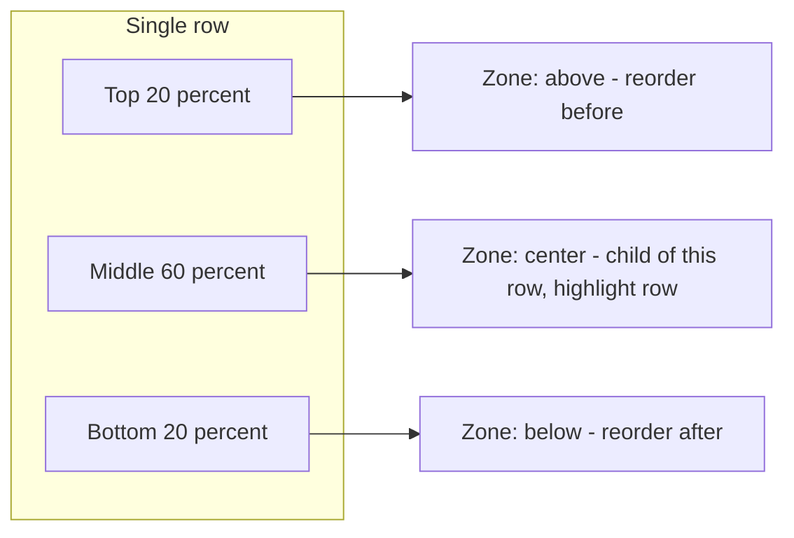

# SortableTree: Drop zones by vertical position only

## Current behavior (to remove)

- [SortableTree.tsx](apps/web/src/components/sortableTree/SortableTree.tsx): `handleDragMove` sets `offsetLeft = delta.x`; `getProjection(..., offsetLeft, indentationWidth)` uses it to compute depth via `getDragDepth(offset, indentationWidth)` in [utilities.ts](apps/web/src/components/sortableTree/utilities.ts).
- The active item’s row is used as the “indicator” (thin line) and receives `projected.depth` so its width/indentation changes with horizontal drag. No explicit “parent highlight” for nesting.

## Target behavior

1. **No horizontal influence**

Cursor left/right and `delta.x` must not affect placement. Remove all `offsetLeft` / `dragOffset` usage from projection and from the keyboard sensor context.

2. **Drop zone from pointer Y only**

For the **over** droppable, define three vertical zones (same idea as [sections tree-utils.ts](apps/web/src/components/sections/tree-utils.ts) `getDropZone`, but with your thresholds):

- **Above**: top 20% of the row → reorder as sibling **before** this item.
- **Center**: middle 60% (20%–80%) → make dropped item a **child** of this row; show **parent highlight** (background) on this row, no variable-width line.
- **Below**: bottom 20% → reorder as sibling **after** this item.

3. **Visual feedback**
    - **Reorder (above/below)**: show the existing **indicator line** (thin line) at the gap above or below the over item, at the over item’s depth (sibling level).
    - **Nest (center)**: **do not** show the indicator line for depth change; instead **highlight the background** of the over row (the new parent).

4. **Implementation angles**
    - **Pointer position**: You need current pointer Y during drag. `DragMoveEvent` only gives `delta`, so track pointer in state (e.g. document `pointermove` while `activeId` is set, store `clientY`), or derive from collision/active rect if that’s sufficient and stable.
    - **Over rect**: To compute the zone you need the over element’s bounding rect. Options: (a) have each item report its rect to the parent via a callback + `useLayoutEffect` (id → rect map), or (b) use `useDndContext()` in a child and read `droppableRects.get(over?.id)` (if the library exposes it). Option (a) is self-contained and works with any scroll container.
    - **Projection**: Replace “depth from drag offset” with “depth/parent from drop zone”: new helper e.g. `getProjectionForDropZone(items, activeId, overId, zone)` where `zone in 'above' | 'center' | 'below'`. For `above`/`below`: same parent as `over`, same depth; insert index before/after `over`. For `center`: parent = `over.id`, depth = `over.depth + 1`. Keep the same final shape `{ depth, parentId }` (and whatever you need for insert index) so existing `buildTree` / `arrayMove` logic can stay or be minimally adapted.
    - **Indicator line for reorder**: Today the “indicator” is the active item’s row (ghost) with `projected.depth`. For reorder-only, you want a single line at the **gap** (above or below the over item). Options: (1) Render a **separate** indicator element (e.g. a div in a portal or inside the list) positioned at `overRect.top` (above) or `overRect.bottom` (below), with height ~2–4px and left = `indentationWidth * over.depth`, and hide the “ghost row” indicator when zone === 'center'. (2) Keep using the active row as the line but drive its vertical position (e.g. reordering the flattened list in state so the ghost row is rendered between the right siblings). Option (1) is clearer and matches the sections “divider” approach; it reuses the same rect you already need for the zone.
    - **Parent highlight**: Pass a prop to the over item when zone === 'center', e.g. `isDropTarget` or `dropZone="center"`, and in [TreeItem.tsx](apps/web/src/components/sortableTree/components/TreeItem/TreeItem.tsx) apply a background style (e.g. `bg-primary/15` or similar) when true. No change to depth/indentation for that row.
    - **Items should not change positions when dragging** When dragging tree items, only the clone and indicator should change positions, the original item should not change positions.

## Performance (no per-frame rect reads)

- **Rects**: Do **not** call `getBoundingClientRect()` on every pointer/drag frame. Measure only when:
    - **overId changes**: One `getBoundingClientRect()` for the **over** element only. Store that in state as `overRect`. Zone is computed from current pointer Y and this rect; when the user moves to another row, `overId` changes and you re-measure once for the new over.
    - **Scroll**: If the list scrolls while dragging, subscribe to `scroll` on the list container and re-measure the current over element once per scroll (or debounce ~16ms). Only the single over node—no measuring every item.
- **Ref map for over**: Keep a ref map `id → HTMLElement` (each item passes its droppable ref to the parent via a callback). When `overId` updates, read that node and call `getBoundingClientRect()` once, then setState(overRect). No rect reads inside pointer/drag handlers.
- **Pointer Y and re-renders**: Avoid updating pointer Y in React state on every `pointermove` (that re-renders every frame). Instead:
    - Store **pointer Y in a ref** (updated on every `pointermove`).
    - Run a **requestAnimationFrame** loop while dragging: read `pointerYRef.current` and `overRect`, compute `getDropZone(pointerY, overRect.top, overRect.height)`, and **setState(dropZone)** only when the zone **actually changes**. Re-renders then only happen when the zone flips or when overId/overRect change.
- **Summary**: Zero rect reads per frame; one rect read per over change and per scroll; minimal re-renders by updating state only when dropZone (or over) changes.

## Files to touch

| Area | File | Changes |

| -------------- | ------------------------------------------------------------------------------------------------------ | ------------------------------------------------------------------------------------------------------------------------------------------------------------------------------------------------------------------------------------------------------------------------------------------------------------------------------------------------------------------------------------------------------------------------------------------ |

| State & events | [SortableTree.tsx](apps/web/src/components/sortableTree/SortableTree.tsx) | Remove `offsetLeft`; ref map (id→node) from item callbacks; pointer Y in ref + document `pointermove` while dragging; measure over rect only when `overId` changes (and on scroll); rAF loop to compute dropZone from ref + overRect and setState only when zone changes; zone-based projection; pass to items: dropZone, indicator above/below, isDropTarget. |

| Projection | [utilities.ts](apps/web/src/components/sortableTree/utilities.ts) | Add `getDropZone(pointerY, top, height)` (return 'above' \| 'center' \| 'below'); add `getProjectionForDropZone(items, activeId, overId, zone)` returning `{ depth, parentId }` (and if needed insert semantics). Refactor or remove `getProjection`’s use of `dragOffset` so it’s only used from the new path (or remove it once callers are updated). |

| Keyboard | [keyboardCoordinates.ts](apps/web/src/components/sortableTree/keyboardCoordinates.ts) | Stop using horizontal offset for depth. Keyboard “nest” can be e.g. Right over an item (center), and “unnest” Left; depth changes only via explicit over item + zone, not via `offset`. Align with the new projection API (e.g. pass a synthetic zone or overId + zone). |

| Item UI | [TreeItem.tsx](apps/web/src/components/sortableTree/components/TreeItem/TreeItem.tsx) | Support “parent highlight” when this row is the drop target (center zone): e.g. prop `isDropTarget` and apply background. Optionally support “show indicator above me” / “show indicator below me” if you render the line inside the item; otherwise the line can be a sibling element. |

| Indicator | [SortableTree.tsx](apps/web/src/components/sortableTree/SortableTree.tsx) (or a small inner component) | When zone is 'above' or 'below', render a single indicator line (div) at the correct Y (overRect.top or overRect.bottom) and left offset `indentationWidth * over.depth`. When zone === 'center', do not render this line (only the parent highlight). Hide or repurpose the current “ghost row as indicator” so it doesn’t show a variable-width line for nesting. |

## Edge cases

- **Scroll**: Item rects change on scroll. Re-measure on scroll (e.g. same ref/callback that reports rects, run on scroll when dragging) or use a scroll listener on the list container so the zone and indicator position stay correct.
- **Collision**: You still use `over` from dnd-kit to know which row is under the pointer; only the **vertical position within that row** decides above/center/below.
- **Announcements**: Update `getMovementAnnouncement` (and any a11y strings) to use the new projection (sibling vs child) based on zone instead of depth delta.

## Optional

- Remove the `console.log` in [TreeItem.tsx](apps/web/src/components/sortableTree/components/TreeItem/TreeItem.tsx) (line 46) if it was for debugging.

## Diagram (concept)

No mermaid for data flow: pointer Y + over rect → getDropZone → getProjectionForDropZone → depth/parentId; reorder uses line at gap, center uses row highlight.
